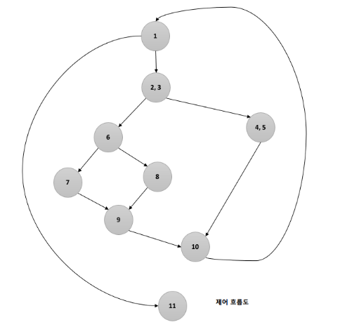
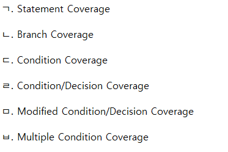
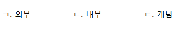
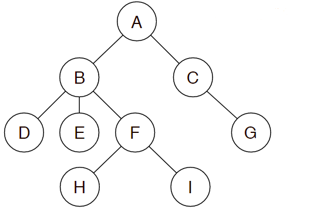

# 최성혁이랑 정처기 공부하기
##### 정처기 서로 문제내려고 만든 리포지토리입니다---- @1102csh

#### 1.  java 기반 오픈 소스 형태로, 서블릿 컨테이너에서 실행되는 서버 기반 도구, 가장 많이 사용되는 빌드 자동화 도구이다. **SVN, Git** 등 대부분의 형상 관리 도구와 연동이 가능하다. 이것은?

<details>
<summary>정답 보기</summary>

- Jenkins

</details>

<br>
<br>

#### 2. 제어 흐름도가 다음과 같을 때, 순환 복잡도를 계산하시오.



<details>
<summary>정답 보기</summary>

- 순환 복잡도 = `화살표의 수 - 노드의 수 + 2` = `11 - 9 + 2`

</details>
<br>
<br>

#### 3. 모듈에 대한 설명이다 빈칸에 올바른 단어는?
```Markdown
"독립적인 모듈 설계를 위해선 ⓐ를 약하게, ⓑ를 강하게 하는 것이 좋다."
```

<details>
<summary>정답 보기</summary>

- ⓐ. 결합도
- ⓑ. 응집도

</details>
<br>
<br>

#### 4. 다음은 화이트박스 테스트에 대한 문제이다. 보기에서 설명에 알맞은 것을 고르시오.

#### <보기>


```Markdown
ⓐ. 프로그램 내의 모든 명령문을 적어도 한 번 수행함.
ⓑ. 결정 포인트 내의 각 개별 조건식이 적어도 한 번은 참과 거짓의 결rhk가 되도록 수행함.
ⓒ. 개별 조건식이 다른 개별 조건식에 영향으 받지 않고 전체 조건식에 독립적으로 영향을 주도록 함으로써 조건/결정 커버리지를 향상시킨 커버리지
```

<details>
<summary>정답 보기</summary>

- ⓐ. ㄱ
- ⓑ. ㄷ
- ⓒ. ㅁ

</details>
<br>
<br>

#### 5. 아래 설명에 알맞은 디자인 패턴은?
```Markdown
- 서브 시스템의 가장 앞쪽에 위치한다.
- 서브 시스템에 있는 객체들을 사용할 수 있도록 인터페이스 역할을 수행
- 서브 클래스들 사이의 통합 인터페이스를 제공하는 Wrapper 객체가 필요
```
<details>
<summary>정답 보기</summary>

- Facade

</details>
<br>
<br>

#### 6. 아래 설명에 알맞은 디자인 패턴은?
```Markdown
- 서브 시스템의 가장 앞쪽에 위치한다.
- 서브 시스템에 있는 객체들을 사용할 수 있도록 인터페이스 역할을 수행
- 서브 클래스들 사이의 통합 인터페이스를 제공하는 Wrapper 객체가 필요
```
<details>
<summary>정답 보기</summary>

- Facade

</details>

<br>
<br>

#### 7. 응용 프로그램 개발 시, 운영체제나 프로그래밍 언어 등에 있는 라이브러리를 이용할 수 있도록 규칙 등을 정의해놓은 인터페이스는?

<details>
<summary>정답 보기</summary>

- API

</details>


<br>
<br>

#### 8. 데이터베이스의 '스키마'에 대한 설명이다. 설명이 올바른 것을 짝지어 고르시오.
#### <보기>


```Markdown
ⓐ. 전체적인 논리적 구조로, 개체 간의 관계와 제약 조건을 나타내는 것.
ⓑ. 사용자나 응용 프로그래머가 각 개인의 입장에서 필요로 하는 데이터베이스의 논리적 구조를 정의한 것.
ⓒ. 물리적인 저장장치 입장에서 데이터가 저장되는 방법을 기술한 것.
```

<details>
<summary>정답 보기</summary>

- ⓐ. ㄷ
- ⓑ. ㄱ
- ⓒ. ㄴ

</details>
<br>
<br>

#### 9. 데이터베이스의 '스키마'에 대한 설명이다. 설명이 올바른 것을 짝지어 고르시오.
#### <보기>


```Markdown
ⓐ. 전체적인 논리적 구조로, 개체 간의 관계와 제약 조건을 나타내는 것.
ⓑ. 사용자나 응용 프로그래머가 각 개인의 입장에서 필요로 하는 데이터베이스의 논리적 구조를 정의한 것.
ⓒ. 물리적인 저장장치 입장에서 데이터가 저장되는 방법을 기술한 것.
```

<details>
<summary>정답 보기</summary>

- ⓐ. ㄷ
- ⓑ. ㄱ
- ⓒ. ㄴ

</details>
<br>
<br>

#### 10. 다음 트리 사진을 보고 물음에 답하시오.
#### <트리>


```Markdown
1. 차수는?
2. Preorder 결과는?
3. Inorder 결과는?
4. Postorder 결과는?
```

<details>
<summary>정답 보기</summary>

- 1. 3
- 2. A-B-D-E-F-H-I-C-G
- 3. D-B-E-H-F-I-A-C-G
- 4. D-E-H-I-F-B-G-C-A

</details>
