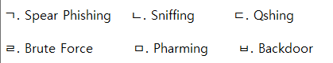
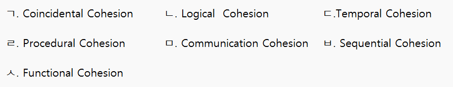

# 최성혁이랑 정처기 공부하기
##### 정처기 서로 문제내려고 만든 리포지토리입니다---- @1102csh

#### 1.  java 기반 오픈 소스 형태로, 서블릿 컨테이너에서 실행되는 서버 기반 도구, 가장 많이 사용되는 빌드 자동화 도구이다. **SVN, Git** 등 대부분의 형상 관리 도구와 연동이 가능하다. 이것은?

<details>
<summary>정답 보기</summary>

- Jenkins

</details>

<br>
<br>

#### 2. 제어 흐름도가 다음과 같을 때, 순환 복잡도를 계산하시오.


<details>
<summary>정답 보기</summary>

- 순환 복잡도 = `화살표의 수 - 노드의 수 + 2` = `11 - 9 + 2`

</details>
<br>
<br>

#### 3. 모듈에 대한 설명이다 빈칸에 올바른 단어는?
```Markdown
"독립적인 모듈 설계를 위해선 ⓐ를 약하게, ⓑ를 강하게 하는 것이 좋다."
```

<details>
<summary>정답 보기</summary>

- ⓐ. 결합도
- ⓑ. 응집도

</details>
<br>
<br>

#### 4. 다음은 화이트박스 테스트에 대한 문제이다. 보기에서 설명에 알맞은 것을 고르시오.

#### <보기>


```Markdown
ⓐ. 프로그램 내의 모든 명령문을 적어도 한 번 수행함.
ⓑ. 결정 포인트 내의 각 개별 조건식이 적어도 한 번은 참과 거짓의 결과가 되도록 수행함.
ⓒ. 개별 조건식이 다른 개별 조건식에 영향으 받지 않고 전체 조건식에 독립적으로 영향을 주도록 함으로써 조건/결정 커버리지를 향상시킨 커버리지
```

<details>
<summary>정답 보기</summary>

- ⓐ. ㄱ
- ⓑ. ㄷ
- ⓒ. ㅁ

</details>
<br>
<br>

#### 5. 아래 설명에 알맞은 디자인 패턴은?
```Markdown
- 서브 시스템의 가장 앞쪽에 위치한다.
- 서브 시스템에 있는 객체들을 사용할 수 있도록 인터페이스 역할을 수행
- 서브 클래스들 사이의 통합 인터페이스를 제공하는 Wrapper 객체가 필요
```
<details>
<summary>정답 보기</summary>

- Facade

</details>

<br>
<br>

#### 6. 응용 프로그램 개발 시, 운영체제나 프로그래밍 언어 등에 있는 라이브러리를 이용할 수 있도록 규칙 등을 정의해놓은 인터페이스는?

<details>
<summary>정답 보기</summary>

- API

</details>


<br>
<br>

#### 7. 데이터베이스의 '스키마'에 대한 설명이다. 설명이 올바른 것을 짝지어 고르시오.
#### <보기>


```Markdown
ⓐ. 전체적인 논리적 구조로, 개체 간의 관계와 제약 조건을 나타내는 것.
ⓑ. 사용자나 응용 프로그래머가 각 개인의 입장에서 필요로 하는 데이터베이스의 논리적 구조를 정의한 것.
ⓒ. 물리적인 저장장치 입장에서 데이터가 저장되는 방법을 기술한 것.
```

<details>
<summary>정답 보기</summary>

- ⓐ. ㄷ
- ⓑ. ㄱ
- ⓒ. ㄴ

</details>
<br>
<br>

#### 8. 다음은 보안 공격에 대한 설명이다. 설명에 올바른 것을 각각 고르시오.
#### <보기>


```Markdown
ⓐ. 네트워크에서 전송되는 데이터를 가로채는 공격
ⓑ. 사용자가 의도하지 않은 웹사이트로 리디렉션되는 공격
ⓒ. 일반적인 이메일을 위장한 메일을 지속적으로 발송하여, 메일 본문의 링크나 파일을 클릭하도록 유도해 개인 정보를 탈취하는 공격
```

<details>
<summary>정답 보기</summary>

- ⓐ. ㄴ
- ⓑ. ㅁ
- ⓒ. ㄱ

</details>
<br>
<br>

#### 9. 다음 트리 사진을 보고 물음에 답하시오.
#### <트리>


```Markdown
1. 차수는?
2. Preorder 결과는?
3. Inorder 결과는?
4. Postorder 결과는?
```

<details>
<summary>정답 보기</summary>

- 1. 3
- 2. A-B-D-E-F-H-I-C-G
- 3. D-B-E-H-F-I-A-C-G
- 4. D-E-H-I-F-B-G-C-A

</details>

<br>
<br>

#### 10. 아래는 모듈의 응집도(Cohesion)에 대한 설명이다. 보기에서 설명에 올바른 것을 짝지어 고르시오.
#### <보기>



```Markdown
ⓐ. 유사한 성격, 특정형태로 분류되는 처리요소들이 한모듈에서 처리되는 경우의 응집도

ⓑ. 동일한 입출력을 사용하여 다른기능을 수행하는 활동들이 모여있을 경우의 응집도

ⓒ. 모듈이 다수의 관련기능을 가질 때 모듈안의 구성요소들이 그 기능을 순차적으로 수행할 경우의 응집도
```
<details>
<summary>정답 보기</summary>

- ⓐ. ㄴ
- ⓑ. ㅁ
- ⓒ. ㄹ

</details>
<br>
<br>

#### 11. 빅데이터의 V3로 바른 것을 고르시오
```Markdown
① Volume
② Velocity
③ Variety
④ Variability
⑤ Value
⑥ Veracity
```
<details>
<summary>정답 보기</summary>

- ①, ②, ③
</details>

<br>
<br>

#### 12. 어떤 릴레이션 R이 A, B, C 세 속성을 가지고 있으며, A → B이고 B → C가 성립한다고 할 때, A → C의 종속성을 통해 유도되는 함수 종속을 제거하기 위한 정규형의 이름은?

<details>
<summary>정답 보기</summary>

- 제 3정규형 (3NF)

</details>

<br>
<br>

#### 13. 아래 제시된 설명은 라우팅 프로토콜에 대한 설명이다. 빈칸에 들어갈 프로토콜의 이름을 서술하시오.
```
ⓐ는(은) 거리 벡터 라우팅 프로토콜이라고도 불리며, 최단 경로 탐색에 Bellman-Ford 알고리즘이 사용된다. 
라우팅 정보를 30초마다 네트워크 내의 모든 라우터에게 알리며, 
180초 이내에 새로운 라우팅 정보가 수신되지 않으면 해당 경로를 이상 상태로 간주한다.
ⓑ은(는) ⓐ의 단점을 해결하여 새로운 기능을 지원하는 프로토콜로, 대규모 네트워크에서 많이 사용된다. 
라우팅 정보에 변화가 생길 경우, 변화된 정보만 네트워크 내의 모든 라우터에게 알린다. 
최단 경로 탐색에 Dijkstra 알고리즘을 사용한다.
```
<details>
<summary>정답 보기</summary>

- ⓐ. RIP (Routing Information Protocol)
- ⓑ. OSPF (Open Shortest Path First protocol)

</details>

<br>
<br>

#### 14. 소스 코드 최적화는 나쁜 코드(Bad Code)는 배제하고, 클린 코드(Clean Code)로 작성하는 것이다. 아래 설명에서 말하는 나쁜 코드를 지칭하는 용어는?
```
- 소스 코드가 복잡하게 얽힌 모습을 비유한 표현이다.
- 작동은 정상적으로 하지만, 사람이 코드를 읽으면서 그 코드의 작동을 파악하기는 어렵다.
- GOTO 문을 지나치게 많이 사용하거나, 프로그램을 구조적으로 만들지 않는 경우에 만들어지기 쉽다.
```

<details>
<summary>정답 보기</summary>

- 스파게티 코드

</details>

<br>
<br>

#### 15. 다음은 4개의 프로세스에 대한 도착 시간과 실행 시간이다. 비선점형 SJF 스케줄링을 사용할 때, 평균 대기시간을 구하시오.
| 프로세스 | 도착 시간 | 실행 시간 |
| ---- | ----- | ----- |
| P1   | 0     | 8     |
| P2   | 1     | 4     |
| P3   | 2     | 9     |
| P4   | 3     | 5     |


<details>
<summary>정답 보기</summary>

- 7.75

</details>

<br>
<br>

#### 16. 아래에 제시된 보기가 요구하는 사항을 만족하도록 crontab 명령어를 작성하시오.
```
'/root/com.sh' 파일을 매월 15일 8시 30분에 실행한다. 
```
<details>
<summary>정답 보기</summary>

- 30 8 15 * * /root/com.sh

</details>

<br>
<br>

#### 17. 하나의 프로세서 내에 일반 애플리케이션을 처리하는 일반 구역과 보안이 필요한 애플리케이션을 처리하는 보안 구역을 분할하여 관리하는 하드웨이 기반의 보안 기술은 무엇인가?
<details>
<summary>정답 보기</summary>

- 트러스트존 기술 (TrustZone Technology)

</details>

<br>
<br>

#### 18. 아래에서 설명하는 기술은 무엇인가?
```
- 네트워크에서 하나의 물리적인 코어 네트워크 인프라를 독립된 다수의 가상 네트워크로 분리하여 다양한 서비스를 제공하는 것을 목적으로 한다.
- 5G의 핵심 기술 중 하나로 손꼽힌다.
```
<details>
<summary>정답 보기</summary>

- 네트워크 슬라이싱 (Network Slicing)

</details>

<br>
<br>

#### 19. 트랜잭션을 수행하는 도중 장애가 발생하여 DB가 손상되었을 때, 손상되기 이전의 정상 상태로 복구하기 위한 '회복' 작업을 수행한다. 로그를 분석하여 트랜잭션의 시작(Start)과 완료(Commit)에 대한 기록이 있는 트랜잭션들의 작업을 재실행하는 기법의 명칭은?

<details>
<summary>정답 보기</summary>

- Redo

</details>

<br>
<br>

#### 20. P2P 네트워크를 이용하여 온라인 금융 거래 정보를 온라인 네트워크 참여자의 디지털 장비에 분산 저장하는 기술을 지칭하는 용어는?

<details>
<summary>정답 보기</summary>

- 블록체인 (Blockchain)

</details>

